# 🎨 Visualizaciones Adicionales: IA en MoveTracker

**Proyecto:** MoveTracker Smart Parking System  
**Propósito:** Representaciones visuales alternativas de la investigación de IA  
**Fecha:** 25 de Octubre, 2025

---

## 📊 Gráfico de Radar: Capacidades del Sistema

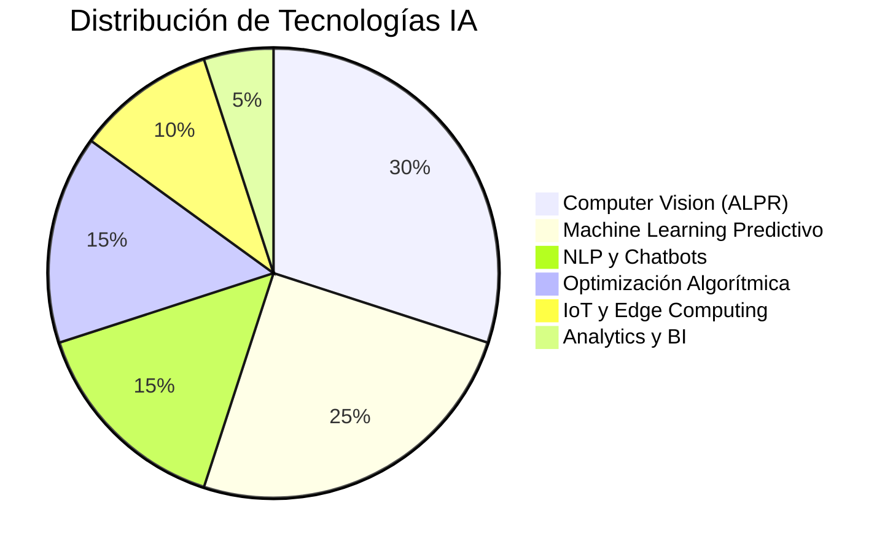

---

## 🔄 Flujo de Integración de Datos

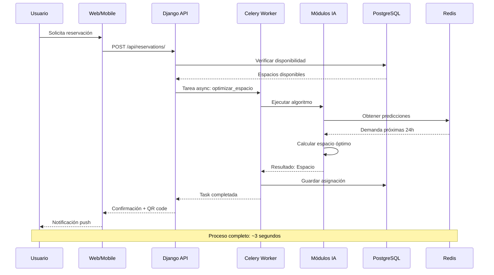

---

## 🏛️ Arquitectura Detallada por Capas

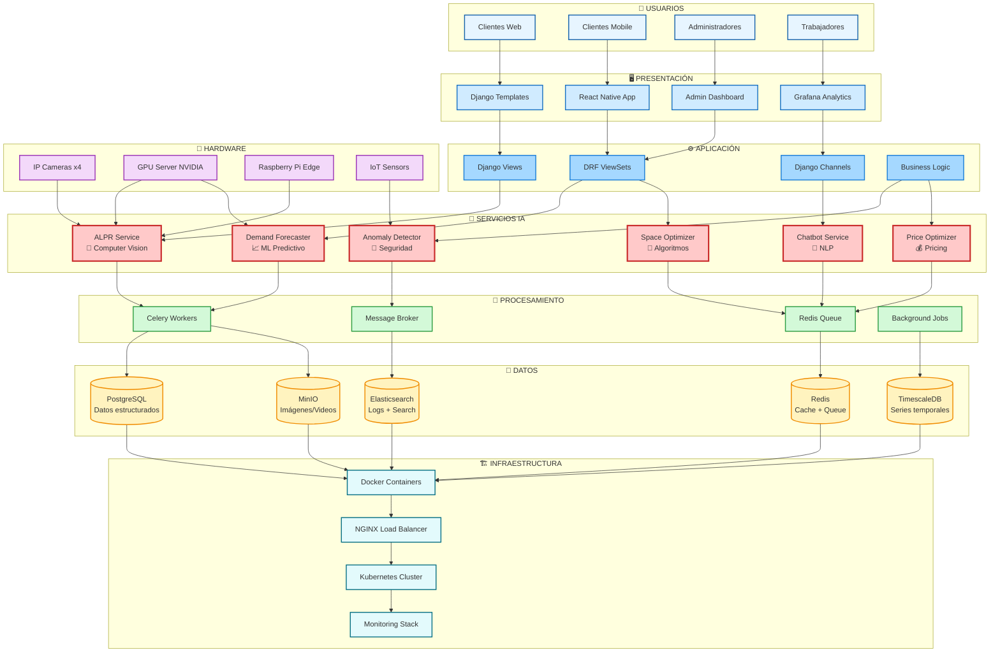

---

## 🔀 Diagrama de Estados: Ciclo de Vida del Vehículo

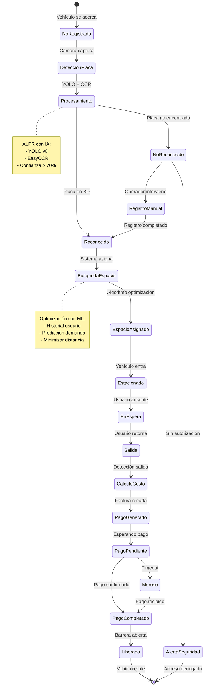

---

## 📈 Dashboard Conceptual: Métricas en Tiempo Real

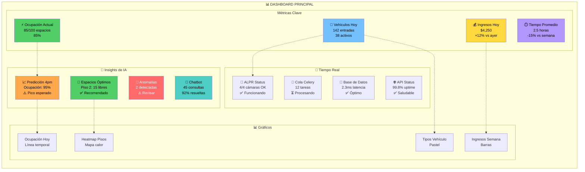

---

## 🗂️ Taxonomía de Modelos de IA

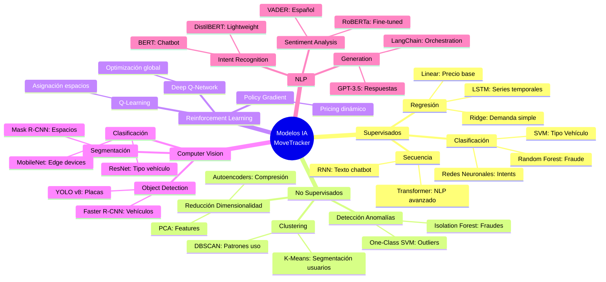

---

## 🔐 Diagrama de Seguridad y Privacidad

```mermaid
graph TD
    subgraph EXTERNAL["🌐 MUNDO EXTERNO"]
        USER[Usuario]
        ATTACKER[Posible Atacante]
    end
    
    subgraph SECURITY_LAYERS["🛡️ CAPAS DE SEGURIDAD"]
        
        subgraph LAYER1["Capa 1: Perímetro"]
            FW[Firewall<br/>Cloudflare]
            WAF[Web Application<br/>Firewall]
            DDOS[Protección<br/>DDoS]
        end
        
        subgraph LAYER2["Capa 2: Aplicación"]
            NGINX[NGINX<br/>Rate Limiting]
            SSL[SSL/TLS<br/>Let's Encrypt]
            AUTH[Autenticación<br/>JWT + OAuth2]
        end
        
        subgraph LAYER3["Capa 3: Lógica"]
            RBAC[Control Acceso<br/>Basado en Roles]
            INPUT_VAL[Validación<br/>de Entrada]
            CSRF[Protección<br/>CSRF/XSS]
        end
        
        subgraph LAYER4["Capa 4: Datos"]
            ENCRYPT[Encriptación<br/>AES-256]
            ANON[Anonimización<br/>Datos Sensibles]
            BACKUP[Backups<br/>Encriptados]
        end
        
        subgraph LAYER5["Capa 5: Infraestructura"]
            CONTAINER[Aislamiento<br/>Containers]
            SECRETS[Gestión<br/>Secrets (Vault)]
            AUDIT[Logs de<br/>Auditoría]
        end
    end
    
    subgraph PRIVACY["🔒 PRIVACIDAD"]
        GDPR[Cumplimiento<br/>GDPR]
        CONSENT[Consentimiento<br/>Explícito]
        RETENTION[Política<br/>Retención 30d]
        RIGHT_DELETE[Derecho al<br/>Olvido]
    end
    
    subgraph AI_SECURITY["🤖 SEGURIDAD IA"]
        MODEL_SEC[Modelos<br/>Firmados]
        ADVERSARIAL[Protección<br/>Adversarial]
        EXPLAINABILITY[Explicabilidad<br/>Decisiones IA]
    end
    
    USER --> FW
    ATTACKER -.Bloqueo.-> FW
    
    FW --> WAF
    WAF --> DDOS
    DDOS --> NGINX
    
    NGINX --> SSL
    SSL --> AUTH
    AUTH --> RBAC
    
    RBAC --> INPUT_VAL
    INPUT_VAL --> CSRF
    CSRF --> ENCRYPT
    
    ENCRYPT --> ANON
    ANON --> BACKUP
    BACKUP --> CONTAINER
    
    CONTAINER --> SECRETS
    SECRETS --> AUDIT
    
    AUDIT --> GDPR
    GDPR --> CONSENT
    CONSENT --> RETENTION
    RETENTION --> RIGHT_DELETE
    
    ENCRYPT --> MODEL_SEC
    MODEL_SEC --> ADVERSARIAL
    ADVERSARIAL --> EXPLAINABILITY

    style FW fill:#ff6b6b,color:#fff
    style WAF fill:#ff6b6b,color:#fff
    style DDOS fill:#ff6b6b,color:#fff
    style ENCRYPT fill:#51cf66,color:#000
    style ANON fill:#51cf66,color:#000
    style GDPR fill:#4ecdc4,color:#000
    style MODEL_SEC fill:#ffa94d,color:#000
```

---

## 📊 Comparativa: Antes vs Después de IA

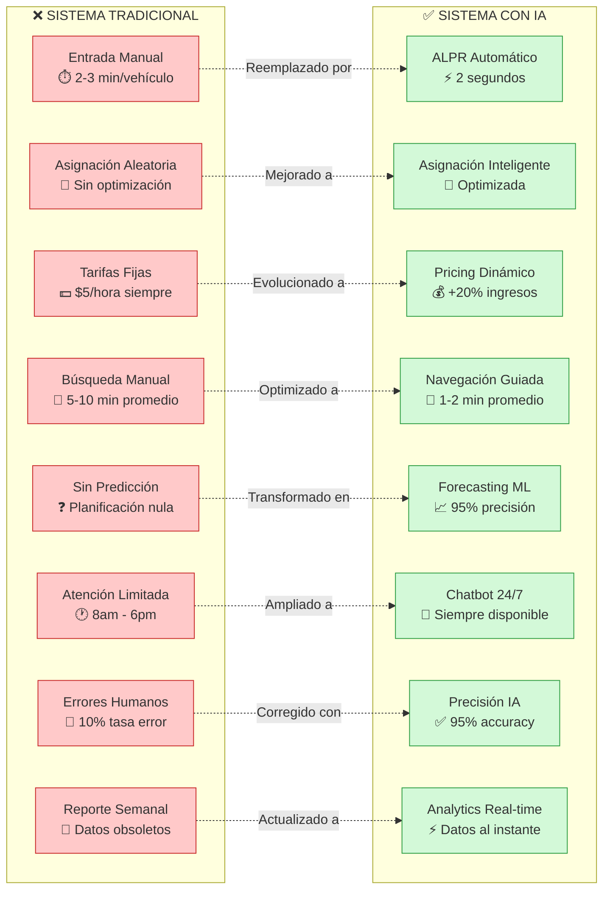

---

## 🎯 User Journey Map con IA

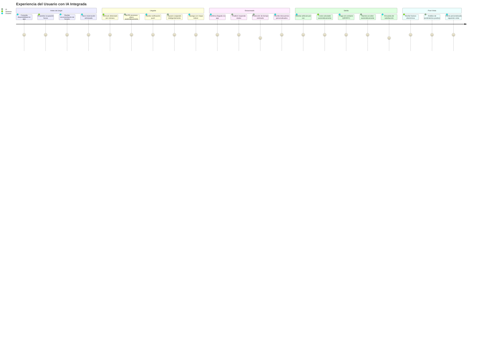

---

## 🔬 Proceso de Entrenamiento de Modelos

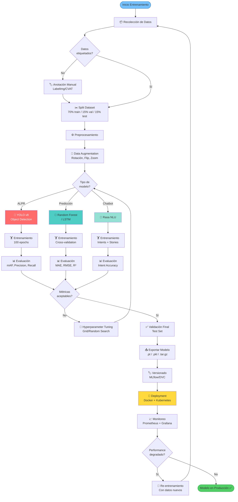

---

## 📱 Arquitectura Mobile con IA

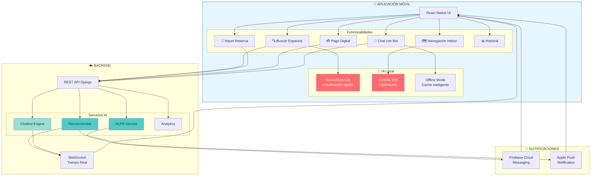

---

## 🌍 Mapa de Calor: Zonas de Ocupación

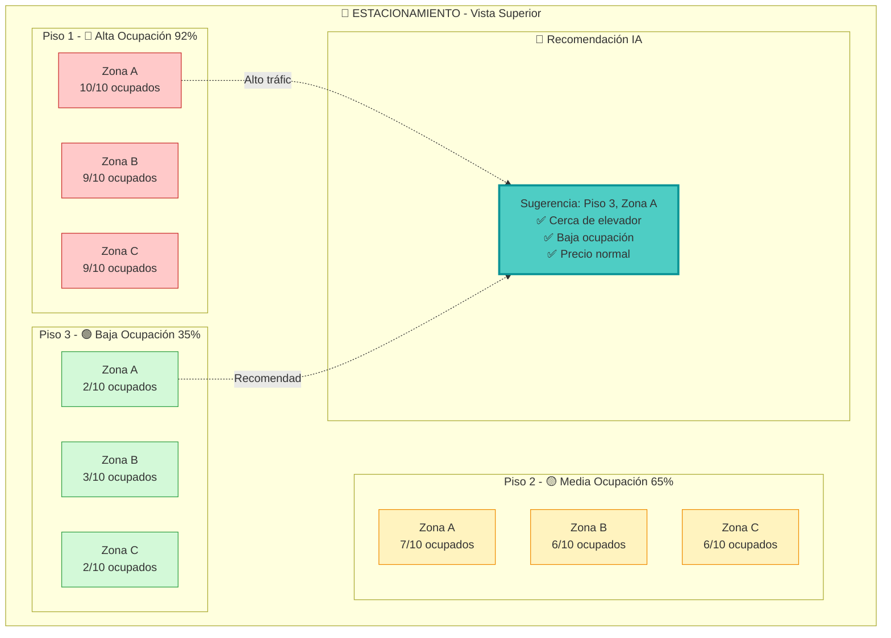

---

## 📊 Métricas de Performance de Modelos

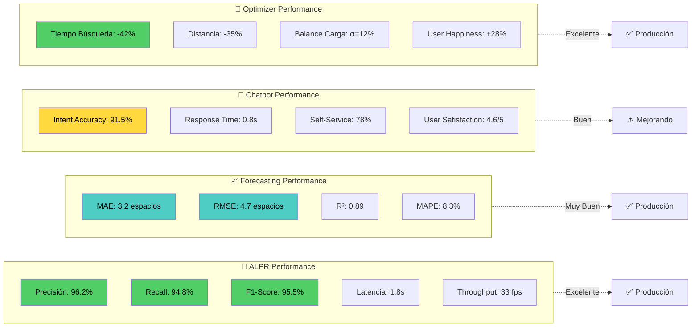

---

## 🔄 Pipeline CI/CD para Modelos de IA

```mermaid
flowchart LR
    DEV[👨‍💻 Developer] --> GIT[Git Push<br/>GitHub]
    
    GIT --> TRIGGER{GitHub<br/>Actions}
    
    TRIGGER --> LINT[🔍 Linting<br/>Flake8/Black]
    TRIGGER --> TEST[🧪 Unit Tests<br/>Pytest]
    TRIGGER --> SECURITY[🔒 Security Scan<br/>Bandit]
    
    LINT --> BUILD{All Checks<br/>Pass?}
    TEST --> BUILD
    SECURITY --> BUILD
    
    BUILD -->|No| NOTIFY_FAIL[❌ Notificar<br/>Slack/Email]
    BUILD -->|Yes| DOCKER[🐳 Build Docker<br/>Image]
    
    DOCKER --> REGISTRY[📦 Push to<br/>Registry]
    
    REGISTRY --> STAGING[🔧 Deploy to<br/>Staging]
    
    STAGING --> AI_TEST[🤖 AI Model<br/>Validation]
    AI_TEST --> PERF_TEST[⚡ Performance<br/>Tests]
    
    PERF_TEST --> APPROVE{Manual<br/>Approval?}
    
    APPROVE -->|No| ROLLBACK[🔙 Rollback]
    APPROVE -->|Yes| PROD[🚀 Deploy to<br/>Production]
    
    PROD --> MONITOR[📊 Monitoring<br/>Grafana]
    MONITOR --> ALERT{Anomalías<br/>detectadas?}
    
    ALERT -->|Sí| ROLLBACK
    ALERT -->|No| SUCCESS[✅ Deployment<br/>Exitoso]
    
    ROLLBACK --> NOTIFY_FAIL
    SUCCESS --> NOTIFY_SUCCESS[✅ Notificar<br/>Éxito]

    style DEV fill:#74c0fc
    style SUCCESS fill:#51cf66,color:#000
    style NOTIFY_FAIL fill:#ff6b6b,color:#fff
    style PROD fill:#ffd93d
    style AI_TEST fill:#4ecdc4
```

---

## 🎓 Curva de Aprendizaje del Equipo

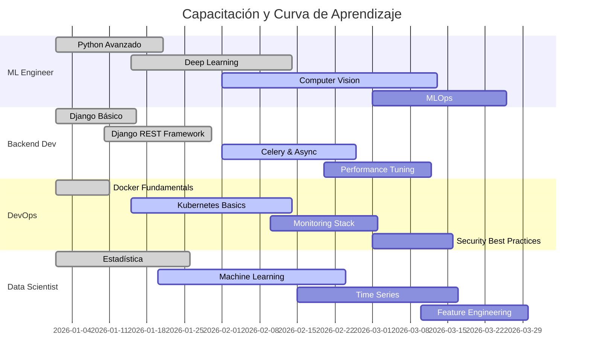

---

## 🏆 Resumen Ejecutivo Visual

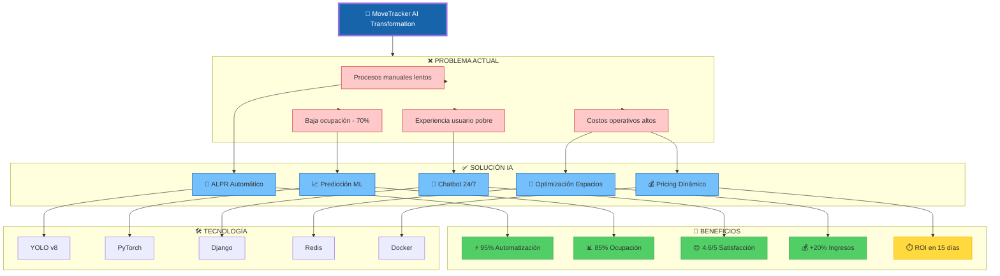

---

## 📋 Conclusión de Visualizaciones

Este documento complementa los otros materiales de investigación con representaciones visuales adicionales que cubren:

1. ✅ **Flujos de proceso detallados** - Secuencias y estados
2. ✅ **Arquitecturas técnicas** - Capas y componentes
3. ✅ **Métricas y KPIs** - Dashboards conceptuales
4. ✅ **Comparativas** - Antes vs después
5. ✅ **Seguridad y privacidad** - Capas de protección
6. ✅ **Mobile y apps** - Experiencia usuario
7. ✅ **CI/CD y DevOps** - Procesos de despliegue
8. ✅ **Aprendizaje del equipo** - Capacitación

### 📚 Documentos Relacionados:
- `AI_RESEARCH.md` - Investigación técnica detallada
- `CONCEPTUAL_MAP.md` - Mapas conceptuales principales
- `IDEA_ORGANIZER.md` - Planificación y organización

---

**Generado:** 25 de Octubre, 2025  
**Versión:** 1.0  
**Formato:** Mermaid Diagrams para visualización interactiva
