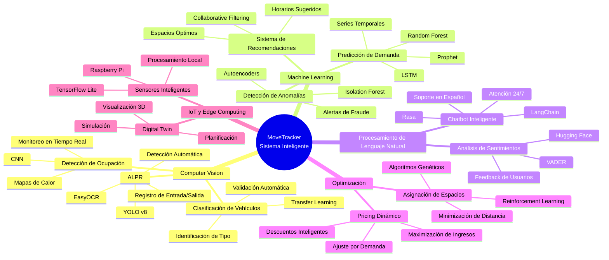
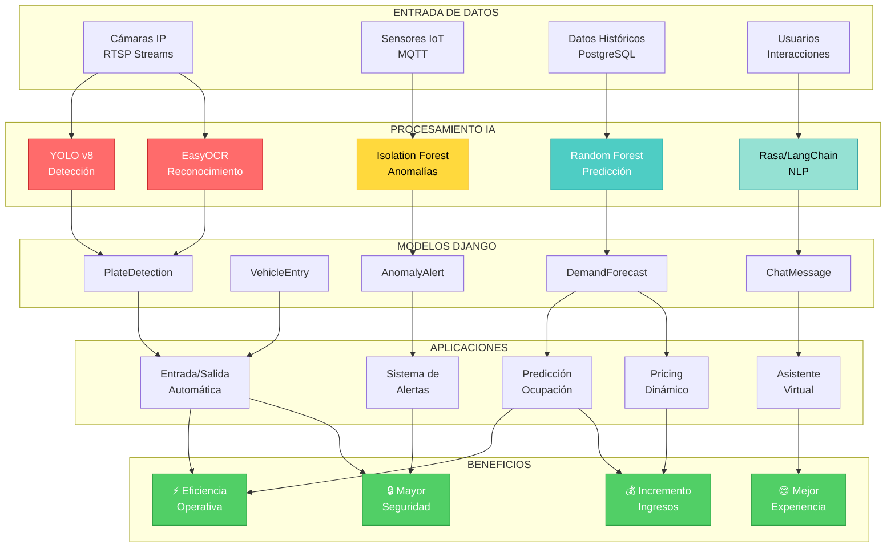
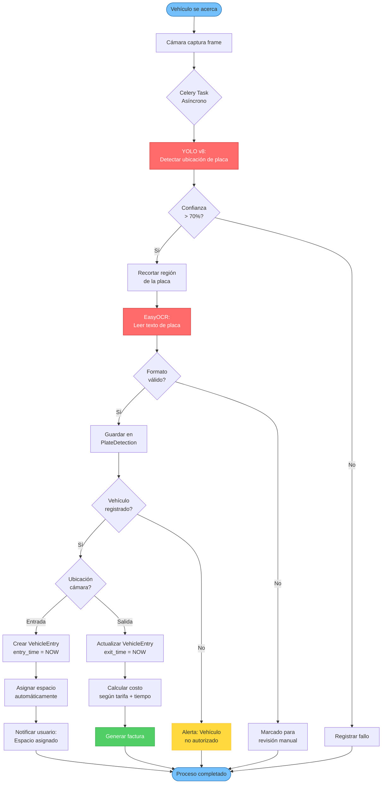
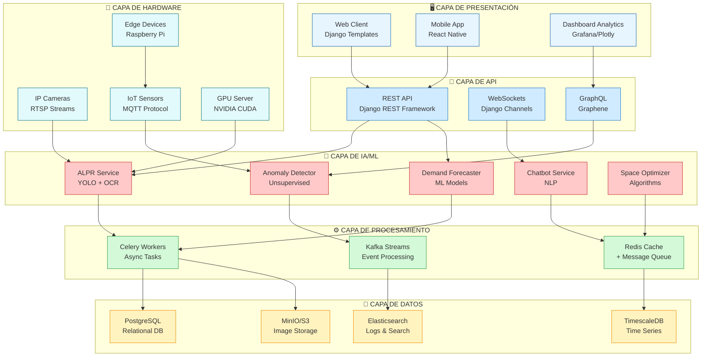
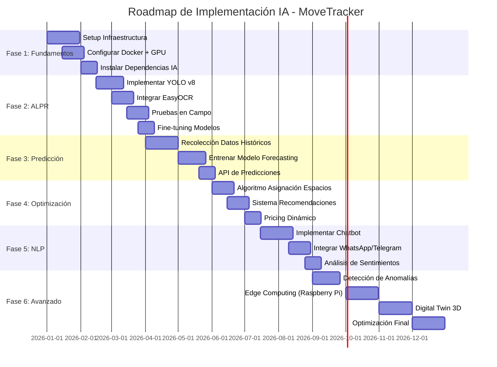
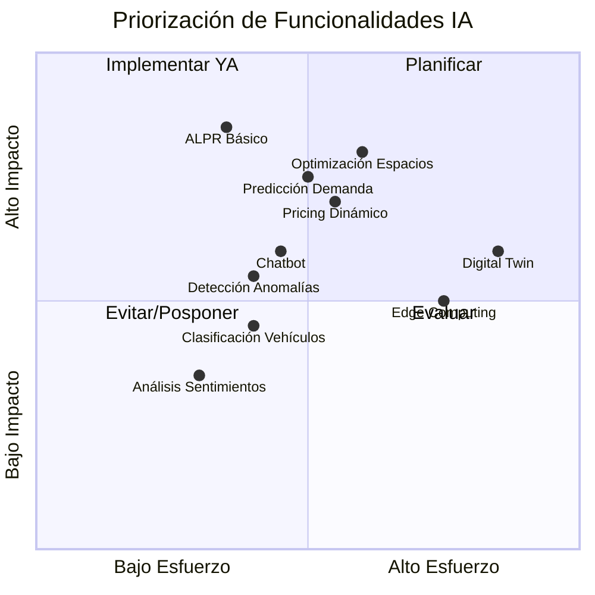
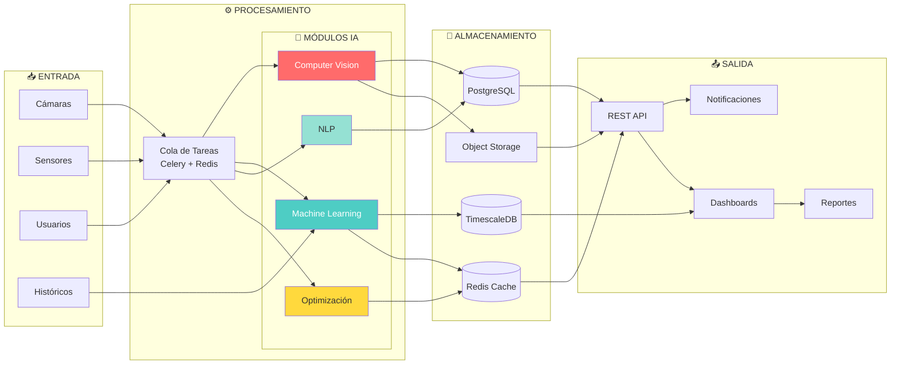
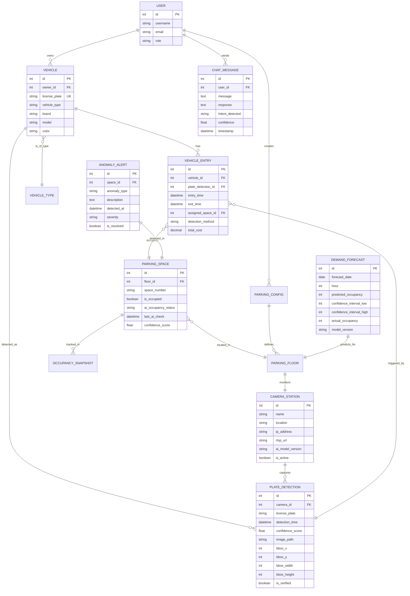
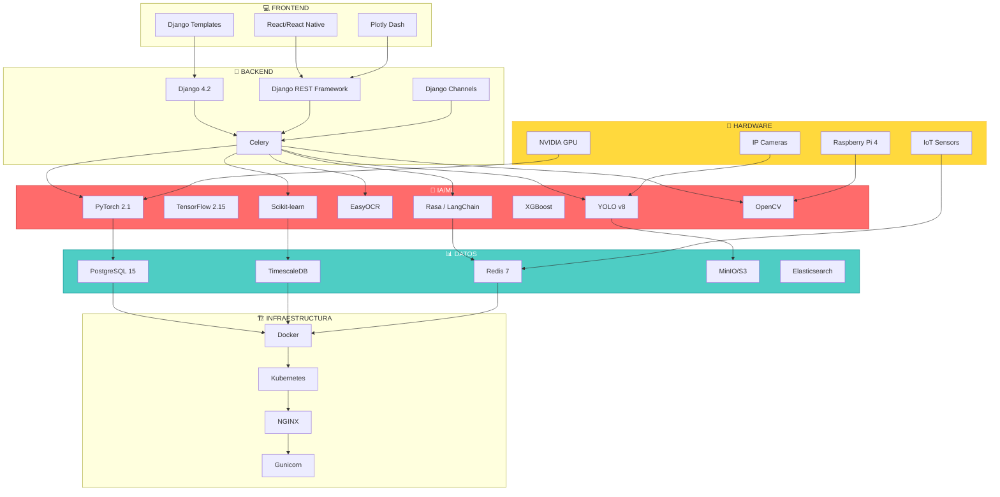
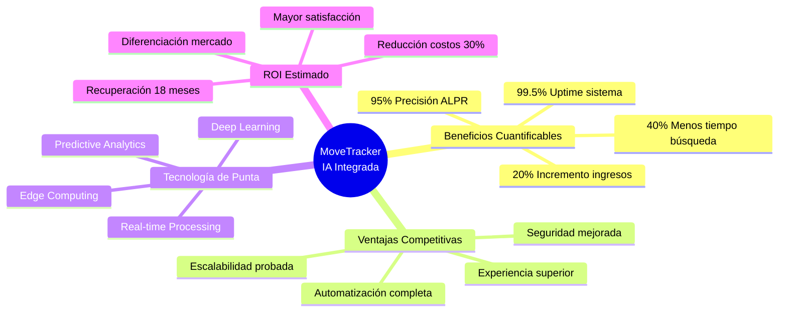

# 🗺️ Mapa Conceptual: IA en MoveTracker

## Diagrama Principal - Ecosistema de IA

---

## Diagrama de Relaciones - Tecnologías y Aplicaciones

---

## Flujo de Proceso ALPR (Reconocimiento de Placas)

---

## Arquitectura de Capas - Sistema de IA

---

## Timeline de Implementación

---

## Matriz de Prioridades - Impacto vs Esfuerzo

---

## Diagrama de Flujo de Datos - Sistema Completo

---

## Modelo de Datos Extendido con IA

---

## Stack Tecnológico Completo

---

## Conclusión Visual

---

**Documento generado:** 25 de Octubre, 2025  
**Versión:** 1.0  
**Herramienta:** Mermaid.js para diagramas interactivos
